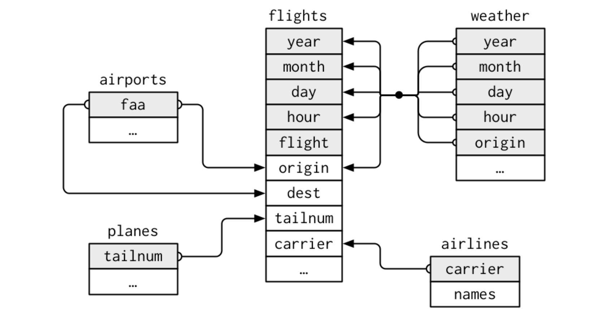

```{r setup, include=FALSE}
knitr::opts_chunk$set(echo = TRUE)
```

```{r message=FALSE, warning=FALSE}
library(tidyverse)
library(nycflights13)
library(gapminder)
library(Lahman)
#tidyverse_update()
```

## Data Transformation
```{r}
flights <- tibble(flights)
class(flights)
str(flights)
```


### Filter

near() is a safe wat of compare if two vector of floading point numbers are equal.

#### Examples
```{r}
# Logical operators 
filter(flights, month == 1, day == 1) %>% head(5)

filter(flights, month %in% c(11,12) & (dep_time >400 | sched_dep_time < 600) & day != 1)

flights %>% filter(between(hour,0,6))%>% select(1:5,time_hour) %>% head(3)

# Missing values
df <- tibble(x = c(1, NA, 3))
filter(df, x > 1)
filter(df, is.na(x) | x > 1)
```
#### Exercises
```{r}
# Had an arrival delay of two or more hours
flights %>% filter(arr_delay >=2) %>% head(3)

# Flew to Houston (IAH or HOU)
flights %>% filter(dest=="IAH" | dest=="HOU") %>% select(1:5,dest) %>% head(3)

# Were operated by United, American, or Delta
flights %>% filter(carrier %in% c("AA","UA","DL"))%>% select(1:5,carrier) %>% head(3)

# Arrived more than two hours late, but didn’t leave late
flights %>% filter(arr_delay>2 & dep_delay<=0)%>% select(1:5,dep_delay, arr_delay) %>% head(3)

# Were delayed by at least an hour, but made up over 30 minutes in flight
flights %>% filter(dep_delay>1 & air_time>30)%>% select(1:5,hour) %>% head(3)


# Departed between midnight and 6am (inclusive)
flights %>% filter(hour<=6)%>% select(1:5,time_hour) %>% head(3)

#Another useful dplyr filtering helper is between(). What does it do? Can you use it to simplify the code needed to answer the previous challenges?
flights %>% filter(between(hour,0,6))%>% select(1:5,time_hour) %>% head(3)
filter(flights, between(month, 7, 9))


#How many flights have a missing dep_time? What other variables are missing? What might these rows represent?
flights %>% filter(is.na(dep_time))

#Why is NA ^ 0 not missing? Why is NA | TRUE not missing? Why is FALSE & NA not missing? Can you figure out the general rule? (NA * 0 is a tricky counterexample!)
NA^0
NA*0
FALSE & NA
```


### Order/Arrange
#### Examples
```{r}
flights %>% arrange(year,month,day)

flights %>% arrange(desc(dep_delay))%>% select(1:5,dep_delay) %>% head(3)


# Missing values are always sorted at the end (no matter desc or asec)
df %>% arrange(x)
df %>% arrange(desc(x))

```
#### Exercises

```{r}
#How could you use arrange() to sort all missing values to the start? (Hint: use is.na()).
flights %>% arrange(desc(is.na(.)))
flights %>% arrange(desc(is.na(dep_time)))

#Sort flights to find the most delayed flights. Find the flights that left earliest.
flights %>% arrange(desc(dep_delay)) %>% slice(1)
flights %>% arrange(dep_delay)%>% slice(1)

#Sort flights to find the fastest (highest speed) flights.
flights %>% arrange(desc(distance/air_time)) %>% top_n(1)

flights %>% mutate(speed=distance/air_time) %>%arrange(desc(speed))  %>% top_n(1)

#Which flights travelled the farthest? Which travelled the shortest?
flights %>% arrange()
```

### slice
#### Examples
```{r}
# first the first 5 results
flights %>% top_n(5)
flights %>% head(5)

# find the first 10 results but obmit the first three
flights %>% slice(4:10)
flights %>% filter(between(row_number(), 4, 10))

# find the first 1e-05 records
flights %>% top_frac(1e-05)
```

### Select
Tidyverse selections implement a dialect of R where operators make it easy to select variables:

* : for selecting a range of consecutive variables.

* ! for taking the complement of a set of variables.

* & and | for selecting the intersection or the union of two sets of variables.

* c() for combining selections.

In addition, you can use *selection helpers*. Some helpers select specific columns:

* everything(): Matches all variables.

```{r}
## move some colums to the begining
select(flights, time_hour, air_time, everything())
```


* last_col(): Select last variable, possibly with an offset.

These *helpers* select variables by matching patterns in their names:

* starts_with(): Starts with a prefix.

* ends_with(): Ends with a suffix.

* contains(): Contains a literal string.

* matches(): Matches a regular expression.

* num_range(): Matches a numerical range like x01, x02, x03.

These *helpers* select variables from a character vector:

* all_of(): Matches variable names in a character vector. All names must be present, otherwise an out-of-bounds error is thrown.

* any_of(): Same as all_of(), except that no error is thrown for names that don't exist.

This *helper* selects variables with a function:

* where(): Applies a function to all variables and selects those for which the function returns TRUE.
```{r}
flights %>% select(where(is.character))

iris %>% select(where(~is.numeric(.x) && mean(.x) > 3.5)) %>% head(5)
```

#### Examples
```{r}
flights %>% select(year, month, day)
flights %>% select(year:day)
flights %>% select(-(year:day))
```

#### Exercises
```{r}
#select dep_time, dep_delay, arr_time, and arr_delay from flights.
flights %>% select(dep_time, dep_delay, arr_time, arr_delay)
select(flights, matches("^(dep|arr)_(time|delay)$"))
select(flights, starts_with("dep_"), starts_with("arr_"))
variables <- c("dep_time", "dep_delay", "arr_time", "arr_delay")
select(flights, !!variables)

#What happens if you include the name of a variable multiple times in a select() call?
flights %>% select(dep_time, dep_time)

#What does the one_of() function do? Why might it be helpful in conjunction with this vector?
vars <- c("year", "month", "day", "dep_delay", "arr_delay")
flights %>% select(one_of(vars))


#Does the result of running the following code surprise you? How do the select helpers deal with case by default? How can you change that default?
select(flights, contains("TIME"))
select(flights, contains("TIME", ignore.case = FALSE))
select(flights, matches(".TIME."))
```

### mutate

* +, -, *, /, ^,%/% (integer division) and %% (remainder), log(), etc., for their usual mathematical meanings

* lead(), lag()
```{r}
lag(1:5)
lag(1:5, n = 2)
lag(1:5, default = 0)
lead(1:5)
lead(1:5,n=2)
lead(1:5, default = 6)
```


* dense_rank(), min_rank(), percent_rank(), row_number(), cume_dist(), ntile()
```{r}
x <- c(5, 1, 3, 2, 2, NA)
row_number(x)
min_rank(x)
dense_rank(x)
percent_rank(x)
cume_dist(x)

#a rough rank, which breaks the input vector into n buckets
ntile(x, 2)
ntile(1:8, 3)
```


* cumsum(), cummean(), cummin(), cummax(), cumany(), cumall()
```{r}
cumall(c(1,2,3,4,0))
cumany(c(1,2,3,4,0))
```

* na_if(), coalesce()
```{r}
# Use a single value to replace all missing values
x <- sample(c(1:5, NA, NA, NA))
coalesce(x, 0L)

# Or match together a complete vector from missing pieces
y <- c(1, 2, NA, NA, 5)
z <- c(NA, NA, 3, 4, 5)
coalesce(y, z)

# Supply lists by with dynamic dots
vecs <- list(
  c(1, 2, NA, NA, 5),
  c(NA, NA, 3, 4, 5)
)
coalesce(!!!vecs)

```


* if_else(), recode(), case_when()
```{r}
x <- c(-5:5, NA)
if_else(x < 0, NA_integer_, x)
if_else(x < 0, "negative", "positive", "missing")

# Unlike ifelse, if_else preserves types
x <- factor(sample(letters[1:5], 10, replace = TRUE))
ifelse(x %in% c("a", "b", "c"), x, factor(NA))
if_else(x %in% c("a", "b", "c"), x, factor(NA))
# Attributes are taken from the `true` vector,

x <- 1:50
case_when(
  x %% 35 == 0 ~ "fizz buzz",
  x %% 5 == 0 ~ "fizz",
  x %% 7 == 0 ~ "buzz",
  TRUE ~ as.character(x)
)


char_vec <- sample(c("a", "b", "c"), 10, replace = TRUE)
recode(char_vec, a = "Apple")
recode(char_vec, a = "Apple", b = "Banana")
```

#### Examples
```{r}
(flights_sml <- flights %>% select( 
  year:day, 
  ends_with("delay"), 
  distance, 
  air_time) %>% mutate(
  gain = dep_delay - arr_delay,
  speed = distance / air_time * 60,
  gain_per_hour = gain / air_time * 60))

## only keep the mutated variables
flights %>% transmute(gain = dep_delay - arr_delay,
  hours = air_time / 60,
  gain_per_hour = gain / hours)
```

#### Exercises
```{r}
#Currently dep_time and sched_dep_time are convenient to look at, but hard to compute with because they’re not really continuous numbers. Convert them to a more convenient representation of number of minutes since midnight.
time2mins <- function(x) {
  (x %/% 100 * 60 + x %% 100) %% 1440
}
flights_times <- mutate(flights,
  dep_time_mins = time2mins(dep_time),
  sched_dep_time_mins = time2mins(sched_dep_time)
)
# view only relevant columns
select(
  flights_times, dep_time, dep_time_mins, sched_dep_time,
  sched_dep_time_mins
)

#Compare dep_time, sched_dep_time, and dep_delay. How would you expect those three numbers to be related?
flights_delayed <- mutate(flights, 
                          dep_delay_min_rank = min_rank(desc(dep_delay)),
                          dep_delay_row_number = row_number(desc(dep_delay)),
                          dep_delay_dense_rank = dense_rank(desc(dep_delay))
                          )
flights_delayed <- filter(flights_delayed, 
                          !(dep_delay_min_rank > 10 | dep_delay_row_number > 10 | dep_delay_dense_rank > 10))
flights_delayed <- arrange(flights_delayed, dep_delay_min_rank)

select(flights_delayed, month, day, carrier, flight, dep_delay, 
             dep_delay_min_rank, dep_delay_row_number, dep_delay_dense_rank)
```


### Aggregrate/Summary

* center: mean(), meandian();
```{r}
flights %>% group_by(month) %>% 
  summarise(
    avg_delay1 = mean(arr_delay,na.rm = T),
    avg_delay2 = mean(arr_delay[arr_delay > 0],na.rm = T) # the average positive delay
  )
```


* spread: sd(); IOR(The Interquartile Range); mad(Median Absolute Deviation);

* Range: min(), max(), quantile();

* Position: first(), last(), nth();

* Count: n(), n_distinct();
```{r}
flights %>% group_by(dest) %>% 
  summarise(carriers = n_distinct(carrier)) %>% 
  arrange(desc(carriers))


flights %>% count(dest)

flights %>% count(dest,wt = distance,sort = T) # total number of distance each dest has
```


* Logical: any(), all();


#### Examples
```{r}
summarise(flights, delay = mean(dep_delay, na.rm = TRUE))

flights %>% group_by( year, month, day) %>% summarise(delay = mean(dep_delay, na.rm = TRUE))
```

### group by with summarise

#### Examples
```{r}
flights %>% group_by(year,month) %>% summarise(flight=n())

flights %>% group_by(year,month) %>% summarise(flight=n()) %>% summarise(flight=sum(flight)) ## roll up by group from last to first

flights %>% group_by(year,month) %>% ungroup()%>% summarise(flight=n()) 
```

#### Exercises
```{r}
#Brainstorm at least 5 different ways to assess the typical delay characteristics of a group of flights. Consider the following scenarios:
#A flight is 15 minutes early 50% of the time, and 15 minutes late 50% of the time.
flights %>%   filter(!is.na(dep_delay), !is.na(arr_delay)) %>%
              group_by(flight) %>% 
              summarise(early_15_rate=mean(arr_delay<(-15)),
                        late_15_rate=mean(arr_delay>15)) %>%
              filter(near(early_15_rate,0.5),near(late_15_rate,0.5))

#A flight is always 10 minutes late.
flights %>% filter(!is.na(dep_delay), !is.na(arr_delay)) %>%
              group_by(flight) %>% 
              summarise(late_10_rate=mean(arr_delay>10))%>%
              filter(near(late_10_rate,1))

#A flight is 30 minutes early 50% of the time, and 30 minutes late 50% of the time.
flights %>%   filter(!is.na(dep_delay), !is.na(arr_delay)) %>%
              group_by(flight) %>% 
              summarise(early_30_rate=mean(arr_delay<(-30)),
                        late_30_rate=mean(arr_delay>30)) %>%
              filter(near(early_30_rate,0.5),near(late_30_rate,0.5))

#99% of the time a flight is on time. 1% of the time it’s 2 hours late.
flights %>%   filter(!is.na(dep_delay), !is.na(arr_delay)) %>%
              group_by(flight) %>% 
              summarise(ontime_rate=mean(arr_delay==0),
                        late_120_rate=mean(arr_delay>120))%>%
              filter(near(ontime_rate,0.99),near(late_120_rate,0.01))

#Come up with another approach that will give you the same output as not_cancelled %>% count(dest) and not_cancelled %>% count(tailnum, wt = distance) (without using count()).
flights %>% filter(!is.na(dep_delay), !is.na(arr_delay)) %>%
  group_by(dest) %>% summarise(count=n())
  
flights %>% filter(!is.na(dep_delay), !is.na(arr_delay)) %>%
  group_by(tailnum) %>% summarise(count=sum(distance))

#Look at the number of cancelled flights per day. Is there a pattern? Is the proportion of cancelled flights related to the average delay?
(temp <- flights %>% group_by(day) %>% 
      summarise(cancel_rate = mean(is.na(dep_delay) & is.na(arr_delay)),
                average_arr_delay = mean(arr_delay,na.rm = T),
                average_dep_delay = mean(dep_delay,na.rm = T)) %>%
      arrange(desc(cancel_rate)))

cor(temp[,2:4])

#Which carrier has the worst delays? Challenge: can you disentangle the effects of bad airports vs. bad carriers? Why/why not? (Hint: think about flights %>% group_by(carrier, dest) %>% summarise(n()))

flights %>% filter(!is.na(dep_delay), !is.na(arr_delay)) %>%
  group_by(carrier,dest) %>% summarise(average_arr_delay=mean(arr_delay,na.rm = T)) %>% 
  arrange(desc(average_arr_delay))

```


### group by with mutate or filter
```{r}
flights %>% filter(!is.na(dep_delay), !is.na(arr_delay)) %>%
  group_by(year, month) %>%
  filter(rank(desc(arr_delay)) < 3)

popular_dest <- flights %>% 
    group_by(dest) %>%
    filter(n()>10000)
popular_dest %>% distinct(dest)

popular_dest %>% 
  filter(arr_delay > 0) %>% 
  mutate(prop_delay = arr_delay / sum(arr_delay)) %>% 
  select(year:day, dest, arr_delay, prop_delay) %>%
  arrange(desc(prop_delay))

flights %>% filter(!is.na(dep_delay), !is.na(arr_delay)) %>%
  group_by(dest) %>%
  filter(rank(desc(arr_delay)) < 5) %>%
  mutate(rank=rank(arr_delay),
         dense_rank=dense_rank(arr_delay)) %>%
  select(year:day, dest,rank,dense_rank) %>%
  arrange(dest,rank)
```

#### Exercices
```{r}
#Which plane (tailnum) has the worst on-time record?
flights %>%
  filter(!is.na(tailnum), is.na(arr_time) | !is.na(arr_delay)) %>%
  mutate(on_time = !is.na(arr_time) & (arr_delay <= 0)) %>%
  group_by(tailnum) %>%
  summarise(on_time = mean(on_time), n = n()) %>%
  filter(n >= 20) %>%  ## at least 20 flights
  filter(min_rank(on_time) == 1)

flights %>%
  filter(!is.na(arr_delay)) %>%
  group_by(tailnum) %>%
  summarise(arr_delay = mean(arr_delay), n = n()) %>%
  filter(n >= 20) %>%
  filter(min_rank(desc(arr_delay)) == 1)


#What time of day should you fly if you want to avoid delays as much as possible?
flights %>% group_by(hour) %>% 
  summarise(mean_delay = mean(arr_delay,na.rm = T)) %>%
  arrange(mean_delay) %>% top_n(3)


#For each destination, compute the total minutes of delay. For each flight, compute the proportion of the total delay for its destination.
flights %>%
  filter(arr_delay > 0) %>%
  group_by(dest, origin, carrier, flight) %>%
  summarise(arr_delay = sum(arr_delay)) %>%
  group_by(dest) %>%
  mutate(
    arr_delay_prop = arr_delay / sum(arr_delay)
  ) %>%
  arrange(dest, desc(arr_delay_prop)) %>%
  select(carrier, flight, origin, dest, arr_delay_prop)

#Delays are typically temporally correlated: even once the problem that caused the initial delay has been resolved, later flights are delayed to allow earlier flights to leave. Using lag(), explore how the delay of a flight is related to the delay of the immediately preceding flight.
(lagged_delays <- flights %>%
  arrange(origin, month, day, dep_time) %>%
  group_by(origin) %>%
  mutate(dep_delay_lag = lag(dep_delay)) %>%
  #filter(!is.na(dep_delay), !is.na(dep_delay_lag)) %>%
  select(origin, month, day, dep_time,dep_delay_lag))
  
#Look at each destination. Can you find flights that are suspiciously fast? (i.e. flights that represent a potential data entry error). Compute the air time of a flight relative to the shortest flight to that destination. Which flights were most delayed in the air?
flights %>%
  filter(!is.na(air_time)) %>%
  group_by(dest, origin) %>%
  mutate(
    air_time_mean = mean(air_time),
    air_time_sd = sd(air_time),
    air_time_standard = (air_time - air_time_mean) / (air_time_sd + 1)
  ) %>%
  select(dest, origin,air_time_mean,air_time_sd,air_time_standard) %>%
  arrange(desc(air_time_standard)) %>% head(10)

#Find all destinations that are flown by at least two carriers. Use that information to rank the carriers.
flights %>%
   # find all airports with > 1 carrier
   group_by(dest) %>%
   mutate(n_carriers = n_distinct(carrier)) %>%
   filter(n_carriers > 1) %>%
   # rank carriers by numer of destinations
   group_by(carrier) %>%
   summarize(n_dest = n_distinct(dest)) %>%
   arrange(desc(n_dest))

#For each plane, count the number of flights before the first delay of greater than 1 hour.
flights %>%
  # sort in increasing order
  select(tailnum, year, month,day, dep_delay) %>%
  filter(!is.na(dep_delay)) %>%
  arrange(tailnum, year, month, day) %>%
  group_by(tailnum) %>%
  # cumulative number of flights delayed over one hour
  mutate(cumulative_hr_delays = cumsum(dep_delay > 60)) %>%
  # count the number of flights == 0
  summarise(total_flights = sum(cumulative_hr_delays < 1)) %>%
  arrange(total_flights)
```


vignette("window-functions")

### others

```{r}
rename(flights, tail_num = tailnum) %>% select(tail_num)
```
```{r}
# replace all na
df <- tibble(x = c(1, 2, NA), y = c("a", NA, "b"))
df %>% replace_na(list(x = 0, y = "unknown"))
```


##### Duplicate
```{r}
flights %>% distinct(year,month,day,.keep_all = T)
```


### window function
```{r}
batting <- Lahman::Batting %>%
  as_tibble() %>%
  select(playerID, yearID, teamID, G, AB:H) %>%
  arrange(playerID, yearID, teamID) %>%
  semi_join(Lahman::AwardsPlayers, by = "playerID")

players <- batting %>% group_by(playerID)
```
```{r}
# For each player, find the two years with most hits
filter(players, min_rank(desc(H)) <= 2 & H > 0)
# Within each player, rank each year by the number of games played
mutate(players, G_rank = min_rank(G))

# For each player, find every year that was better than the previous year
filter(players, G > lag(G))
# For each player, compute avg change in games played per year
mutate(players, G_change = (G - lag(G)) / (yearID - lag(yearID)))

# For each player, find all years where they played more games than they did on average
filter(players, G > mean(G))
# For each, player compute a z score based on number of games played
mutate(players, G_z = (G - mean(G)) / sd(G))
```


There are five main families of window functions. Two families are unrelated to aggregation functions:

* Ranking and ordering functions: row_number(), min_rank(), dense_rank(), cume_dist(), percent_rank(), and ntile(). These functions all take a vector to order by, and return various types of ranks.

* Offsets lead() and lag() allow you to access the previous and next values in a vector, making it easy to compute differences and trends.

The other three families are variations on familiar aggregate functions:

* Cumulative aggregates: cumsum(), cummin(), cummax() (from base R), and cumall(), cumany(), and cummean() (from dplyr).

* Rolling aggregates operate in a fixed width window. You won’t find them in base R or in dplyr, but there are many implementations in other packages, such as RcppRoll.

* Recycled aggregates, where an aggregate is repeated to match the length of the input. These are not needed in R because vector recycling automatically recycles aggregates where needed. They are important in SQL, because the presence of an aggregation function usually tells the database to return only one row per group.

```{r}
#These are useful if you want to select (for example) the top 10% of records within each group. For example:
filter(players, cume_dist(desc(G)) < 0.1)
```


### tibble
```{r}
iris <- as_tibble(iris)


tibble(
  `:)` = "smile", 
  ` ` = "space",
  `2000` = "number"
)


tribble(
  ~x, ~y, ~z,
  #--|--|----
  "a", 2, 3.6,
  "b", 1, 8.5
)

df <- tibble(
  x = runif(5),
  y = rnorm(5)
)

df %>% .$x
df %>% .[["x"]]
df %>% .[[1]]
```


### tidy data

#### longer
```{r}
table4a
(table4a %>%
  pivot_longer(c(`1999`, `2000`), names_to = "year", values_to = "cases",values_drop_na = TRUE))

```

#### wider
```{r}
table2
(table2 %>%
    pivot_wider(names_from = type, values_from = count))
```

#### separate 
```{r}
table3
table3 %>% separate(rate,into = c("case","population"),sep = "/",convert = TRUE) ## convert into better format

table3 %>% 
  separate(year, into = c("century", "year"), sep = 2) ## select two digit

tibble(x = c("a,b,c", "d,e,f,g", "h,i,j")) %>%
  separate(x, c("one", "two", "three"), extra = "drop")

tibble(x = c("a,b,c", "d,e,f,g", "h,i,j")) %>%
  separate(x, c("one", "two", "three"), extra = "merge")

tibble(x = c("a,b,c", "d,e", "f,g,i")) %>%
  separate(x, c("one", "two", "three"), fill = "left")


#The function extract() uses a regular expression to specify groups in character vector and split that single character vector into multiple columns. This is more flexible than separate() because it does not require a common separator or specific column positions.
tibble(x = c("X1", "X2", "Y1", "Y2")) %>%
  extract(x, c("variable", "id"), regex = "([A-Z])([0-9])")
```

#### Unite
```{r}
table5
table5 %>% unite(date, century, year, sep = "")

```

#### missing
```{r}
stocks <- tibble(
  year   = c(2015, 2015, 2015, 2015, 2016, 2016, 2016),
  qtr    = c(   1,    2,    3,    4,    2,    3,    4),
  return = c(1.88, 0.59, 0.35,   NA, 0.92, 0.17, 2.66)
)
stocks %>% 
  complete(year, qtr) ## find the explicit and implicit missing.


(treatment <- tribble(
  ~ person,           ~ treatment, ~response,
  "Derrick Whitmore", 1,           7,
  NA,                 2,           10,
  NA,                 3,           9,
  "Katherine Burke",  1,           4
))

# fill() takes a set of columns where you want missing values to be replaced by the most recent non-missing value (sometimes called last observation carried forward).
treatment %>% 
  fill(person)
```

### relational data




#### mutate join
```{r}
flights2 <- flights %>% 
  select(year:day, hour, origin, dest, tailnum, carrier)

flights2 %>%
  select(-origin, -dest) %>% 
  left_join(airlines, by = "carrier") %>%
  top_n(5)


## same as
flights2 %>%
  select(-origin, -dest) %>% 
  mutate(name = airlines$name[match(carrier, airlines$carrier)]) %>%
  top_n(5)

# The default, by = NULL, uses all variables that appear in both tables, the so called natural join.
flights2 %>% 
  left_join(weather)%>%
  top_n(5)

#  A named character vector: by = c("a" = "b"). This will match variable a in table x to variable b in table y.
flights2 %>% 
  left_join(airports, c("dest" = "faa"))
```


#### filter join

* semi_join(x, y) keeps all observations in x that have a match in y.

* anti_join(x, y) drops all observations in x that have a match in y.

```{r}
top_dest <- flights %>%
  count(dest, sort = TRUE) %>%
  head(10)

flights %>% 
  filter(dest %in% top_dest$dest)%>%
  head(10)

flights %>% 
  semi_join(top_dest)%>%
  head(10)

flights %>%
  anti_join(planes, by = "tailnum") %>%
  count(tailnum, sort = TRUE)%>%
  head(10)
```


#### set operation

* intersect(x, y): return only observations in both x and y.

* union(x, y): return unique observations in x and y.

* setdiff(x, y): return observations in x, but not in y.

#### Examples
#### Exercises

```{r}

```

